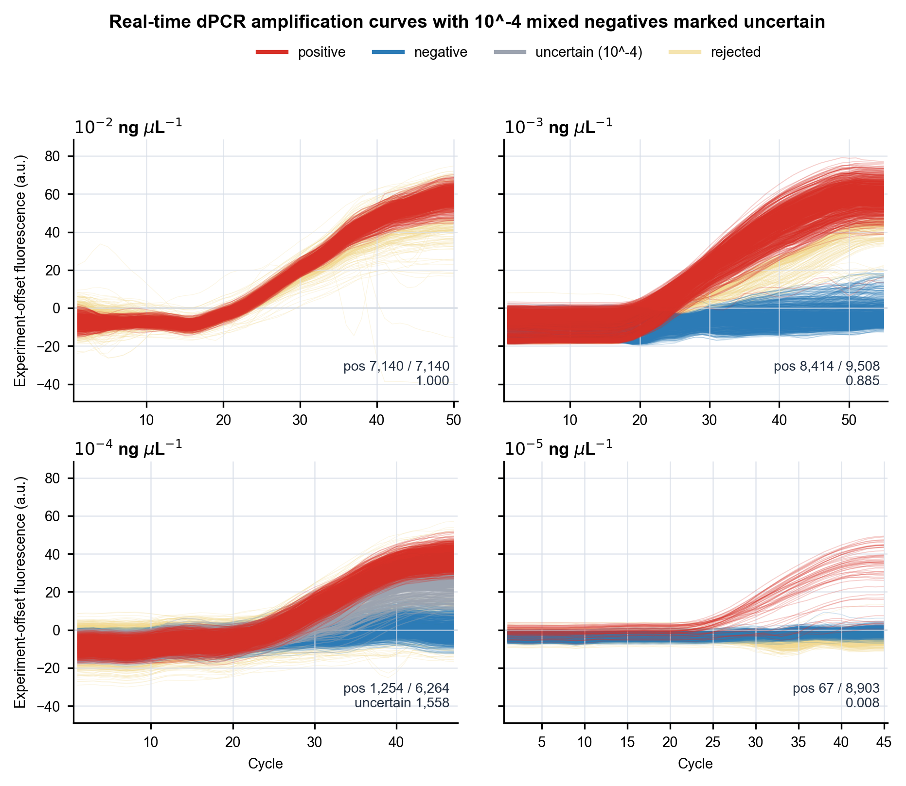
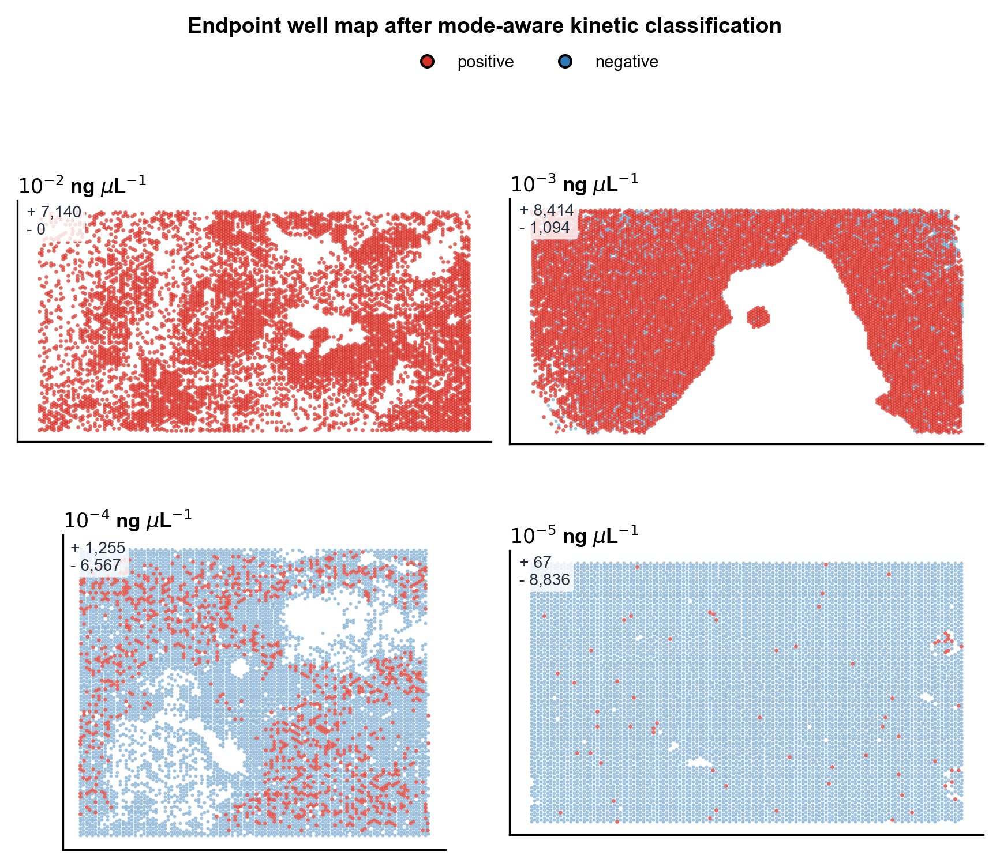

# 实时数字 PCR 图像处理与曲线分类算法说明

日期：2026-06-24

本文档记录当前用于四组 RT-dPCR 浓度梯度实验的图像处理、曲线提取、动力学分类和结果可视化流程。对应代码文件为：

`draw_new_method_nature_figures.py`

当前版本在原有 mode-aware kinetic 分类结果基础上，增加了 **10^-4 ng/uL 实验中混杂阴性曲线的不确定标记**：将位于阳性扩增簇附近、动力学表现不够明确的边界孔标记为 `uncertain`，在图中以灰色显示，并在调整后的 10^-4 定量中排除。

## 一、方法目标

本算法面向微孔阵列实时数字 PCR 实验。每个 PCR 循环末采集一张荧光图像，算法需要从连续图像中完成：

1. 微孔定位与有效孔筛选；
2. 单孔实时荧光曲线提取；
3. 终点阳性/阴性分类；
4. 基于实时扩增曲线的动力学修正；
5. 异常曲线和边界曲线质控；
6. 输出阳性孔数、阴性孔数、阳性率、泊松修正结果和可视化图像。

当前提交版本重点解决一个实际问题：

> 在 10^-4 ng/uL 实验中，部分被判为阴性的曲线进入了阳性扩增曲线簇附近。如果继续把这些孔作为明确阴性参与计算，会造成分类解释不一致。因此将这些边界孔标记为不确定孔，并从调整后的 10^-4 定量中排除。

## 二、输入数据

每组实验的 workflow 输出目录中包含以下文件：

- `positive_well_curves.csv`：阳性孔实时曲线；
- `negative_well_curves.csv`：阴性孔实时曲线；
- `combined_curve_outliers.csv`：曲线异常标记；
- endpoint 分类结果和有效孔信息。

动力学分类特征表为：

`D:\RT-dPCR IMG\group\kinetic_classifier_exploration\auto_well_kinetic_feature_table.csv`

四组浓度实验路径如下：

| 浓度 | 数据目录 |
|---|---|
| 10^-2 ng/uL | `D:\RT-dPCR IMG\group\10-2\workflow_result` |
| 10^-3 ng/uL | `D:\RT-dPCR IMG\group\10-3\workflow_result_early_blob_filter` |
| 10^-4 ng/uL | `D:\RT-dPCR IMG\group\10-4\workflow_result` |
| 10^-5 ng/uL | `D:\RT-dPCR IMG\group\10-5\workflow_result` |

## 三、算法流程

### 1. 读取单孔曲线

程序分别读取每组实验中的：

- `positive_well_curves.csv`
- `negative_well_curves.csv`

每条曲线包含：

- 微孔坐标：`x`, `y`
- 循环数：`cycle`
- 图像文件名：`image_name`
- 原始荧光强度：`raw_intensity`
- 平滑后的绘图强度：`smoothed_plotted_value`

为了跨表合并同一个微孔，程序根据坐标生成微孔唯一编号：

```text
xy_key = round(x) + "_" + round(y)
```

### 2. 合并动力学分类特征

程序将每个微孔的曲线数据与动力学分类表合并。合并字段包括：

- `classification_before`：原始分类；
- `classification_after`：动力学修正后的分类；
- `is_rescued`：是否由动力学信息从阴性救回为阳性；
- `is_rejected`：是否被拒绝；
- `is_uncertain`：是否为不确定孔；
- `decision_status`：最终决策状态；
- `cq`：单孔起峰循环；
- `kinetic_score`：动力学评分。

绘图时将 `classification_after` 记为 `final_call`。

### 3. 合并异常曲线标记

程序读取 `combined_curve_outliers.csv`，将以下异常标记合并到每个微孔：

- `is_hidden`
- `is_curve_outlier`
- `is_early_cycle_outlier`
- `is_late_drop_outlier`

这些异常曲线在图中以浅黄色显示，作为图像填充、气泡、漂移或曲线异常的提示。

### 4. 曲线纵向平移

为了让不同实验的曲线可以放在同一坐标尺度下比较，程序对每组实验进行显示用纵向平移：

```text
offset = 早期循环 smoothed_plotted_value 的 97.5% 分位数
display_curve = smoothed_plotted_value - offset
```

这个处理只改变显示位置，不改变曲线形状，也不改变原始分类。

### 5. 原始 mode-aware kinetic 曲线图

原版图保留三类曲线：

- 红色：`final_call == positive`
- 蓝色：`final_call == negative`
- 浅黄色：曲线异常或显示拒绝孔

对应输出文件：

`nature_new_method_positive_negative_curves.png`

### 6. 10^-4 不确定孔灰色覆盖

新增图在原图基础上只修改 10^-4 ng/uL 面板：

- 读取 10^-4 中 `is_uncertain == True` 的微孔；
- 将这些孔从红色/蓝色分类显示中移除；
- 单独以灰色绘制为 `uncertain`；
- 其他三组浓度保持原始显示逻辑。

图中颜色含义为：

| 颜色 | 含义 |
|---|---|
| 红色 | 明确阳性曲线 |
| 蓝色 | 明确阴性曲线 |
| 灰色 | 10^-4 中动力学边界/不确定曲线 |
| 浅黄色 | 异常或 rejected 曲线 |

这一步的意义是：10^-4 处于混合占有区域，部分曲线虽然原始分类接近阴性，但扩增动力学已经进入阳性曲线簇附近。将其作为明确阴性不够稳妥，因此标记为不确定孔，用于质量控制和后续定量排除。

## 四、当前结果

### 1. 原始 mode-aware kinetic 分类结果

| 浓度 | 阳性孔 | 阴性孔 | 总孔数 | 阳性率 |
|---|---:|---:|---:|---:|
| 10^-2 ng/uL | 7140 | 0 | 7140 | 1.000 |
| 10^-3 ng/uL | 8414 | 1094 | 9508 | 0.8849 |
| 10^-4 ng/uL | 1255 | 6567 | 7822 | 0.1604 |
| 10^-5 ng/uL | 67 | 8836 | 8903 | 0.0075 |

### 2. 10^-4 不确定孔排除后的结果

| 项目 | 数值 |
|---|---:|
| 明确阳性孔 | 1254 |
| 明确阴性孔 | 5010 |
| 不确定孔 | 1558 |
| 参与计算总孔数 | 6264 |
| 泊松修正 lambda | 0.22338 |

将 10^-4 中 1558 个不确定孔从调整后的定量中排除后，四个浓度点重新拟合得到：

```text
R^2 = 0.9544
```

## 五、结果图

### 1. 四组浓度实时扩增曲线图

下图为当前推荐使用的曲线图。10^-4 中混杂在阳性曲线簇附近的边界孔已经标为灰色不确定曲线。



图中可以看到：

- 10^-2 基本全阳；
- 10^-3 大部分为阳性，仍有少量阴性；
- 10^-4 出现明显混合区域，部分边界孔被标为灰色不确定；
- 10^-5 为低丰度少数阳性。

### 2. 终点微孔分布图

下图展示各浓度实验的终点微孔空间分布。



该图用于检查阳性孔空间分布是否存在局部聚集、气泡、填充不均或芯片区域性异常。

## 六、输出文件

当前脚本会生成以下主要文件：

- `nature_new_method_positive_negative_curves.png`
- `nature_new_method_positive_negative_curves_ten4_uncertain.png`
- `nature_new_method_endpoint_well_maps.png`
- `new_method_positive_negative_summary.csv`
- `new_method_endpoint_source_data.csv`
- `ten4_uncertain_overlay_audit.csv`

GitHub 仓库中保存的报告文件包括：

- `docs/rt_dpcr_image_processing_algorithm_2026-06-24.md`
- `docs/assets/nature_new_method_positive_negative_curves_ten4_uncertain.png`
- `docs/assets/nature_new_method_endpoint_well_maps.png`
- `docs/results/new_method_positive_negative_summary.csv`
- `docs/results/ten4_uncertain_excluded_lambda_summary.csv`

## 七、方法解释与答辩表述

当前图像处理算法不只是简单进行终点阴阳性判断，而是进一步利用实时扩增曲线进行质量控制。

对于 10^-4 ng/uL 实验，部分曲线处在阳性和阴性之间的动力学灰区。如果只依赖终点阈值，这些孔容易被当作明确阴性；但从实时曲线看，它们又明显接近阳性扩增簇。因此，本方法将这部分孔标记为不确定孔，并在调整后的定量中排除。

可以在答辩中表述为：

> 本研究在传统终点式 dPCR 阳性/阴性判读基础上，引入单孔实时扩增曲线信息，对边界孔和异常孔进行质控识别。对于 10^-4 ng/uL 混合占有区域，算法能够识别终点分类与动力学曲线不一致的微孔，并将其标记为不确定孔，从而提高结果解释的可靠性。

这个处理体现了实时数字 PCR 相比传统终点数字 PCR 的优势：不仅可以知道一个孔最终是否变亮，还可以观察它在整个扩增过程中的动力学行为。
